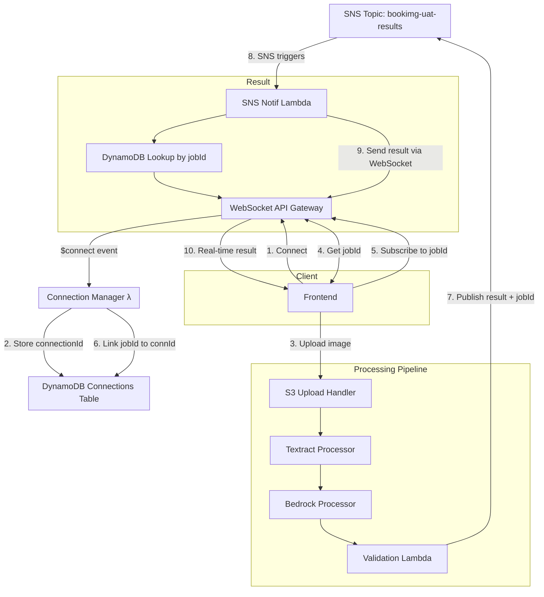

# Async Notification System - BookImg Project

## Current Stack Overview

### Existing Infrastructure

**S3 Buckets:**
- `bookimg-uat` - Image uploads
- `bookimg-uat-results` - Processing results

**Lambda Functions:**
- `upload-handler` - Triggered by S3 uploads, sends to textract queue
- `textract-processor` - OCR text extraction, sends to bedrock queue  
- `bedrock-processor` - LLM candidate generation, sends to validation queue
- `book-validator` - API validation, publishes final results to SNS

**Queues & Topics:**
- `textract-queue` → `bedrock-queue` → `validation-queue`
- `bookimg-uat-results` SNS topic (final results published here)

**API Gateway:**
- HTTP API for web interface at: `https://1fd9v08g3m.execute-api.ap-southeast-2.amazonaws.com/UAT`
- Serves upload form and generates pre-signed S3 URLs

### Current Processing Flow

```
1. User uploads image → S3 bucket
2. S3 triggers upload-handler → textract-queue  
3. textract-processor → extracts text → bedrock-queue
4. bedrock-processor → generates candidates → validation-queue
5. book-validator → validates books → publishes to SNS
6. 🔴 MISSING: Frontend has no way to receive final results
```

## Real-Time Notification Architecture

### High-Level Flow Diagram



### Key Components

**JobId Flow:**
- **Generated by Frontend** before upload (`job-${timestamp}-${random}`)
- **Embedded in S3 key path** (`jobId/filename.jpg`)
- **Extracted by `upload-handler`** from S3 key instead of generating new one
- Passed through all processing stages: textract → bedrock → validation
- Published with final results in SNS message
- Used to lookup WebSocket connectionId in DynamoDB

**Connection Tracking:**
- DynamoDB stores: `jobId → connectionId` mappings
- Allows SNS notification Lambda to find the right WebSocket client
- Handles connection cleanup on disconnect

## Implementation Plan - Option B

### Phase 1: WebSocket Infrastructure

**1. WebSocket API Gateway**
```hcl
# Add to main.tf
resource "aws_apigatewayv2_api" "websocket_api" {
  name          = "${local.resource_prefix}-websocket-api"
  protocol_type = "WEBSOCKET"
  route_selection_expression = "$request.body.action"
}
```

**2. DynamoDB Connections Table**
```hcl
resource "aws_dynamodb_table" "websocket_connections" {
  name           = "${local.resource_prefix}-websocket-connections"
  billing_mode   = "PAY_PER_REQUEST"
  hash_key       = "jobId"
  
  attribute {
    name = "jobId"
    type = "S"
  }
  
  ttl {
    attribute_name = "ttl"
    enabled        = true
  }
}
```

**Schema:**
```json
{
  "jobId": "job-1234567890",
  "connectionId": "abc123def456",
  "timestamp": "2024-01-01T12:00:00Z",
  "ttl": 1704110400
}
```

**3. Connection Manager Lambda**
```javascript
// Handle $connect, $disconnect, subscribe events
exports.handler = async (event) => {
  const { requestContext } = event;
  const { connectionId, eventType, routeKey } = requestContext;
  
  switch (eventType) {
    case 'CONNECT':
      // Store connection with temporary ID
      break;
    case 'DISCONNECT':  
      // Clean up connection records
      break;
    default:
      // Handle subscribe messages
      if (event.body) {
        const { action, jobId } = JSON.parse(event.body);
        if (action === 'subscribe') {
          // Link jobId to connectionId in DynamoDB
        }
      }
  }
};
```

### Phase 2: SNS Integration

**4. SNS Notification Lambda**
```javascript
// Subscribe to existing SNS topic
exports.handler = async (event) => {
  for (const record of event.Records) {
    const snsMessage = JSON.parse(record.Sns.Message);
    const { jobId, status, results } = snsMessage;
    
    // 1. Lookup connectionId by jobId in DynamoDB
    const connection = await dynamodb.get({
      TableName: 'websocket-connections',
      Key: { jobId }
    }).promise();
    
    if (connection.Item) {
      // 2. Send result via WebSocket
      await apigatewayManagement.postToConnection({
        ConnectionId: connection.Item.connectionId,
        Data: JSON.stringify({
          type: 'processingComplete',
          jobId,
          results
        })
      }).promise();
      
      // 3. Clean up connection record
      await dynamodb.delete({
        TableName: 'websocket-connections', 
        Key: { jobId }
      }).promise();
    }
  }
};
```

### Phase 3: Frontend Integration

**5. Update Frontend JavaScript**
```javascript
// Add to lambda-web.js
const websocketUrl = 'wss://[websocket-api-id].execute-api.ap-southeast-2.amazonaws.com/prod';
let ws;
let currentJobId;

function initWebSocket() {
  ws = new WebSocket(websocketUrl);
  
  ws.onopen = () => {
    console.log('WebSocket connected');
  };
  
  ws.onmessage = (event) => {
    const message = JSON.parse(event.data);
    if (message.type === 'processingComplete') {
      displayResults(message.results);
    }
  };
}

async function handleUpload() {
  const file = fileInput.files[0];
  if (!file) return;
  
  // Generate jobId in frontend before upload
  const jobId = `job-${Date.now()}-${Math.random().toString(36).substr(2, 9)}`;
  currentJobId = jobId;
  
  // Subscribe to WebSocket notifications immediately
  ws.send(JSON.stringify({
    action: 'subscribe',
    jobId: jobId
  }));
  
  try {
    // Get pre-signed URL with jobId in filename
    const filename = `${jobId}/${file.name}`;
    const response = await fetch(`/upload-url?filename=${encodeURIComponent(filename)}&contentType=${encodeURIComponent(file.type)}`);
    
    if (!response.ok) throw new Error('Failed to get upload URL');
    
    const signedUrl = await response.text();
    
    // Upload to S3 with jobId in key path
    const uploadResponse = await fetch(signedUrl, {
      method: 'PUT',
      body: file,
      headers: { 'Content-Type': file.type }
    });
    
    if (uploadResponse.ok) {
      showStatus(`Processing started (Job: ${jobId})... You will be notified when complete.`);
    } else {
      throw new Error('Upload failed');
    }
  } catch (error) {
    showStatus(`Upload error: ${error.message}`);
  }
}
```

### Phase 4: Pipeline Updates

**6. Modify Upload Handler**
```javascript
// Extract jobId from S3 key instead of generating
exports.handler = async (event) => {
  for (const record of event.Records) {
    if (record.eventName.startsWith('ObjectCreated')) {
      const bucket = record.s3.bucket.name;
      const key = record.s3.object.key; // e.g., "job-1234567890-abc123/image.jpg"
      
      // Extract jobId from S3 key path
      const jobId = key.split('/')[0]; // Get "job-1234567890-abc123"
      
      console.log(`Processing upload with jobId: ${jobId}`);
      
      // Send to textract queue with extracted jobId
      await sqs.send(new SendMessageCommand({
        QueueUrl: process.env.TEXTRACT_QUEUE_URL,
        MessageBody: JSON.stringify({
          bucket, key, jobId,
          timestamp: new Date().toISOString()
        })
      }));
    }
  }
  
  return { statusCode: 200, body: 'Upload processed' };
};
```

**7. Update SNS Message Format**
```javascript
// In book-validator.js - ensure jobId is included
await sns.send(new PublishCommand({
  TopicArn: process.env.SNS_TOPIC_ARN,
  Subject: `BookImg Processing Complete - Job ${jobId}`,
  Message: JSON.stringify({
    jobId: jobId,           // ✅ Critical for lookup
    status: "complete",
    validatedBooks: finalResults.validatedCount,
    totalCandidates: finalResults.totalCandidates,
    books: finalResults.books,
    resultsLocation: `s3://${resultsBucket}/${jobId}/final-results.json`,
    timestamp: new Date().toISOString()
  })
}));
```

## Implementation Sequence

1. **Deploy WebSocket API + DynamoDB table**
2. **Create & deploy Connection Manager Lambda** 
3. **Create & deploy SNS Notification Lambda**
4. **Subscribe SNS Notification Lambda to existing SNS topic**
5. **Update upload handler to return jobId**
6. **Update frontend with WebSocket support**
7. **Test end-to-end flow**

## Error Handling & Edge Cases

**Connection Cleanup:**
- TTL on DynamoDB records (1 hour)
- Handle stale connections gracefully
- Clean up on disconnect events

**Failed Processing:**
- Send error notifications via WebSocket
- Handle partial failures in pipeline

**Multiple Clients:**
- One jobId can only map to one connectionId
- Handle connection drops and reconnects

## Testing Strategy

**Unit Tests:**
- Connection Manager Lambda
- SNS Notification Lambda  
- DynamoDB operations

**Integration Tests:**
- Complete upload → notification flow
- WebSocket connection lifecycle
- Error scenarios

**Manual Testing:**
- Upload image → verify real-time notification
- Multiple concurrent uploads
- Network disconnection scenarios