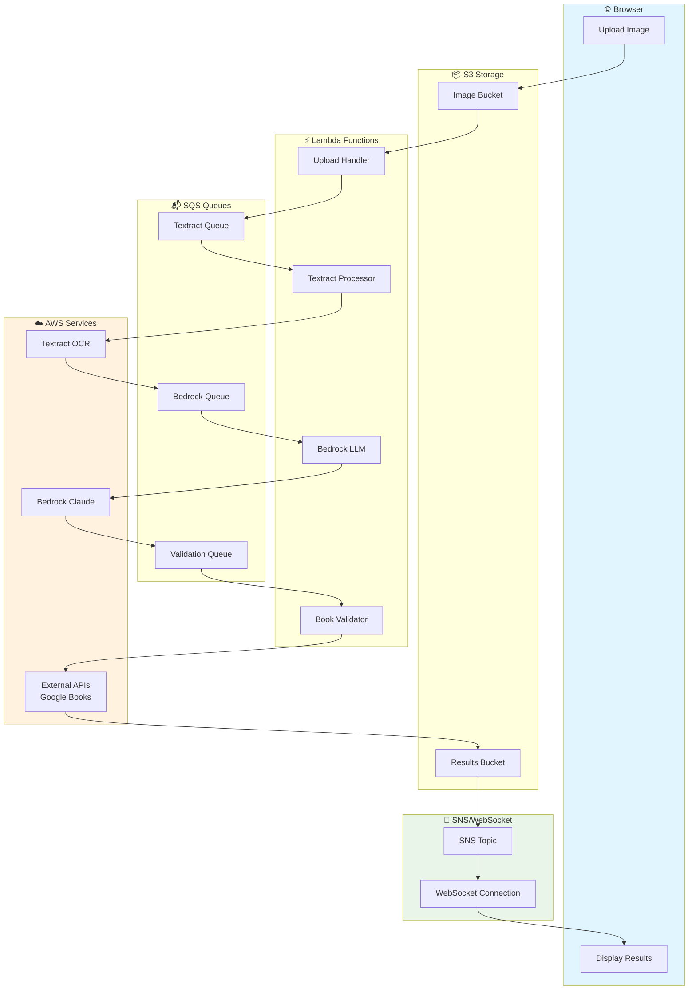

# BookImg Production Architecture

## Overview

This document outlines the production architecture for BookImg - an AI-powered book recognition pipeline that extracts book titles and authors from bookshelf photos using AWS services and LLM processing.

## Architecture Flow



## Service Layers

### 🌐 Browser Layer
- **Upload Image**: Web frontend for bookshelf photo uploads
- **Display Results**: Real-time results display with book metadata and purchase links

### 📦 S3 Storage Layer
- **Image Bucket**: Stores uploaded bookshelf photos with presigned URL uploads
- **Results Bucket**: Stores processed results, intermediate data, and final JSON output

### ⚡ Lambda Functions Layer
Four event-driven Lambda functions handle the processing pipeline:

1. **Upload Handler Lambda**
   - Triggers on S3 upload events
   - Validates image format and size
   - Initiates processing pipeline
   - Returns job ID to frontend

2. **Textract Processor Lambda**
   - Consumes from Textract SQS queue
   - Calls AWS Textract DetectDocumentText
   - Extracts text from book spine images
   - Stores raw OCR results in S3

3. **Bedrock LLM Lambda**
   - Consumes from Bedrock SQS queue
   - Processes OCR text with Claude 3 Haiku
   - Generates structured book candidates (title/author pairs)
   - Applies confidence scoring and filtering

4. **Book Validator Lambda**
   - Consumes from Validation SQS queue
   - Validates candidates against Google Books API
   - Enriches with metadata, ISBNs, cover images
   - Generates purchase links for validated books

### 📬 SQS Queues Layer
Three SQS queues decouple processing stages:
- **Textract Queue**: Queues images for OCR processing
- **Bedrock Queue**: Queues extracted text for LLM processing  
- **Validation Queue**: Queues book candidates for validation

### ☁️ AWS Services Layer
- **Textract OCR**: Extracts text from bookshelf images
- **Bedrock Claude**: Processes fragmented OCR text into structured candidates
- **External APIs**: Google Books API for book validation and metadata enrichment

### 📢 SNS/WebSocket Layer
- **SNS Topic**: Publishes job completion notifications
- **WebSocket Connection**: Real-time updates to frontend showing processing progress

## Data Flow Pattern

1. **Upload Phase**: `Browser → S3 Upload → Upload Handler Lambda → Textract Queue`
2. **OCR Phase**: `Textract Queue → Textract Lambda → AWS Textract → Bedrock Queue` 
3. **LLM Phase**: `Bedrock Queue → Bedrock Lambda → AWS Bedrock → Validation Queue`
4. **Validation Phase**: `Validation Queue → Validation Lambda → Google Books API → Results S3`
5. **Notification Phase**: `Results S3 → SNS Topic → WebSocket → Frontend Display`

## Sample Data Transformation

### Input: Bookshelf Photo
Raw image uploaded via web frontend

### Textract Output (Fragmented Text)
```
DANIEL C. DENNETT FROM BACTERIA TO BACH AND BACK
HARDEN
THE GENETIC
WHY DNA MATTERS
LOTTERY
FOR SOCIAL EQUALITY
Rebel Cell
Cancer, Evolution and
KAT
the Science of Life
ARNEY
```

### Bedrock LLM Output (Structured Candidates)
```json
{
  "candidates": [
    {
      "title": "From Bacteria to Bach and Back",
      "author": "Daniel C. Dennett",
      "confidence": 0.95
    },
    {
      "title": "The Genetic Lottery: Why DNA Matters for Social Equality", 
      "author": "Kathryn Paige Harden",
      "confidence": 0.88
    },
    {
      "title": "Rebel Cell: Cancer, Evolution and the Science of Life",
      "author": "Kat Arney", 
      "confidence": 0.92
    }
  ]
}
```

### Final Output (Validated Results)
```json
{
  "books": [
    {
      "title": "From Bacteria to Bach and Back: The Evolution of Minds",
      "author": "Daniel C. Dennett",
      "isbn": "9780393242072",
      "publisher": "W. W. Norton & Company",
      "publishedDate": "2017-02-07",
      "coverImage": "https://books.google.com/books/content?id=...",
      "purchaseLinks": {
        "amazon": "https://amazon.com/dp/0393242072",
        "googleBooks": "https://books.google.com/books?id=..."
      },
      "confidence": 0.95,
      "validated": true
    }
  ]
}
```

## Architecture Benefits

### Scalability
- Each processing stage scales independently based on queue depth
- Lambda functions auto-scale from 0 to thousands of concurrent executions
- SQS queues handle traffic spikes and provide backpressure management

### Reliability  
- Event-driven architecture with automatic retries
- Dead Letter Queues (DLQ) for failed message handling
- Idempotent processing stages prevent duplicate work

### Cost Efficiency
- Pay-per-invocation pricing with no idle server costs
- Automatic scaling eliminates over-provisioning
- S3 storage costs scale with actual usage

### Monitoring & Observability
- CloudWatch logs and metrics for all Lambda functions
- X-Ray distributed tracing across the entire pipeline
- SNS notifications for error handling and alerting

## Implementation Phases

### Phase 1: Infrastructure Setup
- Create Terraform modules for Lambda functions, SQS queues, SNS topics
- Set up IAM roles and policies for each service
- Configure S3 buckets with proper lifecycle policies
- Deploy infrastructure using existing Terraform workflow

### Phase 2: Lambda Development
- Port existing CLI logic to 4 separate Lambda functions
- Add SQS event handlers and message processing logic
- Implement structured logging and error handling
- Create retry logic and DLQ processing

### Phase 3: Frontend Integration
- Build web frontend with React/Next.js
- Implement presigned S3 upload endpoints
- Create WebSocket connection for real-time updates
- Add job status tracking and progress indicators

### Phase 4: Monitoring & Testing
- Set up CloudWatch dashboards and alarms
- Configure X-Ray service maps for performance monitoring
- Create end-to-end testing framework with sample images
- Load testing and performance optimization

## Security Considerations

- Presigned S3 URLs with expiration times
- IAM roles with least privilege access
- API Gateway with rate limiting and authentication
- VPC configuration for Lambda functions (if required)
- Encryption at rest for S3 buckets and SQS queues

## Deployment Strategy

- Environment-based deployments (dev/staging/prod)
- Blue-green deployments for zero-downtime updates
- Terraform state management with remote backends
- Automated CI/CD pipeline with GitHub Actions

## Next Steps

1. Begin with Phase 1 infrastructure setup using Terraform
2. Develop and test Lambda functions locally with SAM CLI
3. Implement frontend with mock data for rapid iteration
4. Integrate end-to-end pipeline with comprehensive testing
5. Add monitoring, alerting, and production hardening