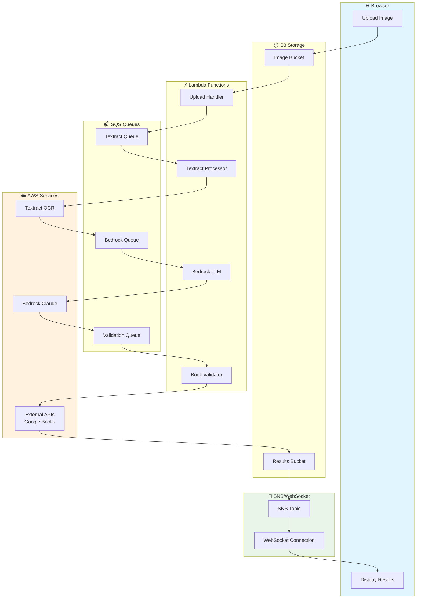

# BookImg Production Architecture

## Overview

This document outlines the production architecture for BookImg - an AI-powered book recognition pipeline that extracts book titles and authors from bookshelf photos using AWS services and LLM processing.

## Architecture Flow



## Service Layers

### 🌐 Browser Layer
- **Upload Image**: Web frontend for bookshelf photo uploads
- **Display Results**: Real-time results display with book metadata and purchase links

### 📦 S3 Storage Layer
- **Image Bucket**: Stores uploaded bookshelf photos with presigned URL uploads
- **Results Bucket**: Stores processed results, intermediate data, and final JSON output

### ⚡ Lambda Functions Layer
Four event-driven Lambda functions handle the processing pipeline:

1. **Upload Handler Lambda**
   - Triggers on S3 upload events
   - Validates image format and size
   - Initiates processing pipeline
   - Returns job ID to frontend

2. **Textract Processor Lambda**
   - Consumes from Textract SQS queue
   - Calls AWS Textract DetectDocumentText
   - Extracts text from book spine images
   - Stores raw OCR results in S3

3. **Bedrock LLM Lambda**
   - Consumes from Bedrock SQS queue
   - Processes OCR text with Claude 3 Haiku
   - Generates structured book candidates (title/author pairs)
   - Applies confidence scoring and filtering

4. **Book Validator Lambda**
   - Consumes from Validation SQS queue
   - Validates candidates against Google Books API
   - Enriches with metadata, ISBNs, cover images
   - Generates purchase links for validated books

### 📬 SQS Queues Layer
Three SQS queues decouple processing stages:
- **Textract Queue**: Queues images for OCR processing
- **Bedrock Queue**: Queues extracted text for LLM processing  
- **Validation Queue**: Queues book candidates for validation

### ☁️ AWS Services Layer
- **Textract OCR**: Extracts text from bookshelf images
- **Bedrock Claude**: Processes fragmented OCR text into structured candidates
- **External APIs**: Google Books API for book validation and metadata enrichment

### 📢 SNS/WebSocket Layer
- **SNS Topic**: Publishes job completion notifications
- **WebSocket Connection**: Real-time updates to frontend showing processing progress

## Data Flow Pattern

1. **Upload Phase**: `Browser → S3 Upload → Upload Handler Lambda → Textract Queue`
2. **OCR Phase**: `Textract Queue → Textract Lambda → AWS Textract → Bedrock Queue` 
3. **LLM Phase**: `Bedrock Queue → Bedrock Lambda → AWS Bedrock → Validation Queue`
4. **Validation Phase**: `Validation Queue → Validation Lambda → Google Books API → Results S3`
5. **Notification Phase**: `Results S3 → SNS Topic → WebSocket → Frontend Display`

## Sample Data Transformation

### Input: Bookshelf Photo
Raw image uploaded via web frontend

### Textract Output (Fragmented Text)
```
DANIEL C. DENNETT FROM BACTERIA TO BACH AND BACK
HARDEN
THE GENETIC
WHY DNA MATTERS
LOTTERY
FOR SOCIAL EQUALITY
Rebel Cell
Cancer, Evolution and
KAT
the Science of Life
ARNEY
```

### Bedrock LLM Output (Structured Candidates)
```json
{
  "candidates": [
    {
      "title": "From Bacteria to Bach and Back",
      "author": "Daniel C. Dennett",
      "confidence": 0.95
    },
    {
      "title": "The Genetic Lottery: Why DNA Matters for Social Equality", 
      "author": "Kathryn Paige Harden",
      "confidence": 0.88
    },
    {
      "title": "Rebel Cell: Cancer, Evolution and the Science of Life",
      "author": "Kat Arney", 
      "confidence": 0.92
    }
  ]
}
```

### Final Output (Validated Results)
```json
{
  "books": [
    {
      "title": "From Bacteria to Bach and Back: The Evolution of Minds",
      "author": "Daniel C. Dennett",
      "isbn": "9780393242072",
      "publisher": "W. W. Norton & Company",
      "publishedDate": "2017-02-07",
      "coverImage": "https://books.google.com/books/content?id=...",
      "purchaseLinks": {
        "amazon": "https://amazon.com/dp/0393242072",
        "googleBooks": "https://books.google.com/books?id=..."
      },
      "confidence": 0.95,
      "validated": true
    }
  ]
}
```

## Architecture Benefits

### Scalability
- Each processing stage scales independently based on queue depth
- Lambda functions auto-scale from 0 to thousands of concurrent executions
- SQS queues handle traffic spikes and provide backpressure management

### Reliability  
- Event-driven architecture with automatic retries
- Dead Letter Queues (DLQ) for failed message handling
- Idempotent processing stages prevent duplicate work

### Cost Efficiency
- Pay-per-invocation pricing with no idle server costs
- Automatic scaling eliminates over-provisioning
- S3 storage costs scale with actual usage

### Monitoring & Observability
- CloudWatch logs and metrics for all Lambda functions
- X-Ray distributed tracing across the entire pipeline
- SNS notifications for error handling and alerting

## Implementation Phases

### Phase 1: Infrastructure Setup
- Create Terraform modules for Lambda functions, SQS queues, SNS topics
- Set up IAM roles and policies for each service
- Configure S3 buckets with proper lifecycle policies
- Deploy infrastructure using existing Terraform workflow

### Phase 2: Lambda Development
- Port existing CLI logic to 4 separate Lambda functions
- Add SQS event handlers and message processing logic
- Implement structured logging and error handling
- Create retry logic and DLQ processing

### Phase 3: Frontend Integration
- Build web frontend with React/Next.js
- Implement presigned S3 upload endpoints
- Create WebSocket connection for real-time updates
- Add job status tracking and progress indicators

### Phase 4: Monitoring & Testing
- Set up CloudWatch dashboards and alarms
- Configure X-Ray service maps for performance monitoring
- Create end-to-end testing framework with sample images
- Load testing and performance optimization

## Security Considerations

- Presigned S3 URLs with expiration times
- IAM roles with least privilege access
- API Gateway with rate limiting and authentication
- VPC configuration for Lambda functions (if required)
- Encryption at rest for S3 buckets and SQS queues

## Deployment Strategy

- Environment-based deployments (dev/staging/prod)
- Blue-green deployments for zero-downtime updates
- Terraform state management with remote backends
- Automated CI/CD pipeline with GitHub Actions

## Implementation Status

### ✅ Completed Infrastructure
- **Terraform Infrastructure**: Complete deployment with bootstrap and main configurations
- **S3 Buckets**: `bookimg-uat` (uploads) and `bookimg-uat-results` (processing results)
- **SQS Queues**: 3 processing queues with dead letter queues for error handling
- **Lambda Functions**: 4 deployed functions with proper IAM roles and environment variables
- **SNS Topic**: Result notifications configured
- **IAM Security**: Deployer user with administrative access, application users with minimal permissions

### ✅ Lambda Function Implementation
All Lambda functions deployed with automatic source code packaging:

1. **Upload Handler** (`upload-handler.js`)
   - Triggers on S3 `ObjectCreated` events
   - Generates unique job IDs
   - Sends processing messages to Textract Queue

2. **Textract Processor** (`textract-processor.js`)
   - Processes images with AWS Textract OCR
   - Stores raw text in results bucket
   - Forwards to Bedrock Queue

3. **Bedrock LLM Processor** (`bedrock-processor.js`)
   - Uses Claude 3 Haiku for text parsing
   - Generates structured book candidates with confidence scores
   - Stores candidates JSON and forwards to Validation Queue

4. **Book Validator** (`book-validator.js`)
   - Validates candidates against Google Books API
   - Enriches with metadata (ISBN, publisher, cover images)
   - Stores final results and publishes SNS notification

### 🔧 Terraform Automation Features
- **Automatic Lambda Packaging**: Uses `archive_file` data source for zero-touch deployments
- **Source Code Change Detection**: Lambda functions update automatically when code changes
- **Environment Variables**: All queue URLs and bucket names injected automatically
- **Dependency Management**: Proper resource dependencies ensure correct deployment order

## Testing the Pipeline

### Prerequisites
1. **AWS CLI configured** with `bookimg-app` profile for application access
2. **Terraform deployed** infrastructure (both bootstrap and main)
3. **Test image** of bookshelf spines ready

### Testing Steps

1. **Deploy/Update Infrastructure**:
   ```bash
   cd terraform
   AWS_PROFILE=bookimg-deployer terraform apply
   ```

2. **Upload Test Image** (triggers the pipeline):
   ```bash
   AWS_PROFILE=bookimg-app aws s3 cp your-bookshelf-image.jpg s3://bookimg-uat/
   ```

3. **Monitor Processing** via CloudWatch Logs:
   - `/aws/lambda/bookimg-uat-upload-handler`
   - `/aws/lambda/bookimg-uat-textract-processor`
   - `/aws/lambda/bookimg-uat-bedrock-processor`
   - `/aws/lambda/bookimg-uat-book-validator`

4. **Check Results**:
   ```bash
   # List processing results
   aws s3 ls s3://bookimg-uat-results/ --recursive
   
   # Download final results
   aws s3 cp s3://bookimg-uat-results/job-TIMESTAMP/final-results.json ./
   ```

5. **Monitor SQS Queues** (should process quickly and return to 0):
   - `bookimg-uat-textract-queue`
   - `bookimg-uat-bedrock-queue`
   - `bookimg-uat-validation-queue`

### Expected Results Structure
```json
{
  "jobId": "job-1693424567890",
  "timestamp": "2024-08-30T23:15:67.890Z",
  "totalCandidates": 3,
  "validatedCount": 2,
  "books": [
    {
      "title": "From Bacteria to Bach and Back",
      "author": "Daniel C. Dennett",
      "confidence": 0.95,
      "status": "validated",
      "validation": {
        "validated": true,
        "isbn": "9780393242072",
        "publisher": "W. W. Norton & Company",
        "publishedDate": "2017-02-07",
        "thumbnail": "https://books.google.com/books/content?id=..."
      }
    }
  ]
}
```

## Monitoring & Debugging

### CloudWatch Logs
Each Lambda function creates its own log group:
```bash
# View recent logs
aws logs tail /aws/lambda/bookimg-uat-upload-handler --follow

# List all BookImg log groups
aws logs describe-log-groups --log-group-name-prefix "/aws/lambda/bookimg-uat"
```

### SQS Queue Monitoring
```bash
# Check queue depths
aws sqs get-queue-attributes --queue-url $(terraform output -raw textract_queue_url) --attribute-names ApproximateNumberOfMessages

# Check dead letter queues
aws sqs get-queue-attributes --queue-url QUEUE_URL --attribute-names ApproximateNumberOfMessages
```

### SNS Notifications
Results are published to SNS topic. Subscribe via email/SMS for notifications:
```bash
aws sns subscribe --topic-arn $(terraform output -raw sns_topic_arn) --protocol email --notification-endpoint your-email@example.com
```

## Troubleshooting

### Common Issues
1. **No Lambda Trigger**: Ensure upload to `bookimg-uat` not `bookimg-uat-results`
2. **Permission Errors**: Check Lambda execution role has required AWS service permissions
3. **Queue Backlog**: Check dead letter queues for failed messages
4. **Bedrock Errors**: Verify Bedrock Claude access in your AWS region
5. **Google Books Validation**: API may rate limit; consider adding API key

### Error Recovery
- **Failed Messages**: Check dead letter queues and replay if needed
- **Stuck Queues**: Purge queues and re-upload test image
- **Lambda Timeouts**: Check CloudWatch logs for timeout issues

## API Gateway + Lambda Web Frontend

### ✅ Complete Web Interface
A production-ready web frontend is deployed with htmx integration:

- **Live URL**: https://1fd9v08g3m.execute-api.ap-southeast-2.amazonaws.com/UAT
- **Technology Stack**: Fastify + AWS Lambda Adapter + htmx + API Gateway v2
- **Upload Flow**: Direct S3 pre-signed URL uploads that trigger processing pipeline
- **User Experience**: Drag-and-drop interface with real-time status updates

### Architecture Components

#### API Gateway HTTP API (v2)
- **Protocol**: HTTP (not REST for better performance)
- **Routes**: 
  - `ANY /` - Root page serving htmx interface
  - `ANY /{proxy+}` - Catch-all for API endpoints
- **Stage**: `UAT` (configurable via environment)
- **CORS**: Enabled for web browser access
- **Integration**: AWS_PROXY integration with Lambda

#### Web Lambda Function (`bookimg-uat-web`)
- **Runtime**: Node.js 20.x
- **Framework**: Fastify with AWS Lambda adapter
- **Endpoints**:
  - `GET /` - Serves HTML page with htmx
  - `POST /upload-url` - Generates S3 pre-signed URLs
  - `GET /health` - Health check endpoint
- **Dependencies**: Managed via npm (see deployment notes below)

#### Frontend Features
- **htmx Integration**: No JavaScript framework needed, progressive enhancement
- **File Upload**: Native HTML5 file input with drag-and-drop support
- **Pre-signed S3 URLs**: Secure direct browser-to-S3 uploads
- **Status Updates**: Real-time feedback during upload process
- **Mobile Responsive**: Works on desktop and mobile devices

### Upload Flow Architecture
1. **User selects image** → htmx posts to `/upload-url`
2. **Lambda generates pre-signed URL** → returns JavaScript to browser
3. **Browser uploads directly to S3** using signed URL (bypasses Lambda)
4. **S3 upload triggers existing pipeline** → Upload Handler → processing chain
5. **Results stored in S3** → eventually displayable via status polling

## API Gateway + Lambda Debugging Guide

### Common Issues and Debugging Steps

#### Issue 1: "Not Found" Error
**Symptom**: `{"message":"Not Found"}` when accessing API Gateway URL

**Root Causes**:
- Missing stage name in URL
- Incorrect route configuration
- Integration not properly configured

**Debugging Steps**:
```bash
# Check if URL includes stage name
# ❌ Wrong: https://api-id.execute-api.region.amazonaws.com
# ✅ Correct: https://api-id.execute-api.region.amazonaws.com/STAGE

# Verify API Gateway configuration
aws apigatewayv2 get-api --api-id YOUR_API_ID
aws apigatewayv2 get-routes --api-id YOUR_API_ID
aws apigatewayv2 get-integration --api-id YOUR_API_ID --integration-id INTEGRATION_ID
```

**Solution**: Ensure Terraform output shows stage invoke URL:
```terraform
output "web_api_url" {
  value = aws_apigatewayv2_stage.web_stage.invoke_url  # Not api.api_endpoint
}
```

#### Issue 2: "Internal Server Error"
**Symptom**: `{"message":"Internal Server Error"}` with HTTP 500

**Root Causes**:
- Lambda function runtime errors
- Missing dependencies
- Module import failures
- Incorrect handler configuration

**Debugging Steps**:
```bash
# Check if Lambda is being invoked
aws logs describe-log-groups --log-group-name-prefix "/aws/lambda/FUNCTION_NAME"

# Get recent error logs
aws logs describe-log-streams \
  --log-group-name "/aws/lambda/FUNCTION_NAME" \
  --order-by LastEventTime --descending --limit 1

# View detailed error messages
aws logs get-log-events \
  --log-group-name "/aws/lambda/FUNCTION_NAME" \
  --log-stream-name "LOG_STREAM_NAME"
```

**Common Error Patterns**:
- `Cannot find module 'MODULE_NAME'` → Dependency packaging issue
- `Runtime.ImportModuleError` → Missing or incorrectly packaged dependencies
- `Runtime.HandlerNotFound` → Incorrect handler path in Terraform

#### Issue 3: Lambda Dependency Resolution
**Symptom**: `Error: Cannot find module 'avvio'` or similar missing transitive dependencies

**Root Cause**: 
- pnpm uses symlinked dependency structure that Lambda runtime cannot resolve
- AWS Lambda requires flattened node_modules structure
- pnpm's `.pnpm` directory with symlinks not accessible in Lambda environment

**Investigation**:
```bash
# Check dependency structure in Lambda package
ls terraform/lambda-web-dist/node_modules/
find terraform/lambda-web-dist/node_modules -name "MODULE_NAME"

# pnpm structure (problematic):
# node_modules/.pnpm/avvio@9.1.0/node_modules/avvio  ← Symlinked, Lambda can't access

# npm structure (working):
# node_modules/avvio  ← Direct access, Lambda compatible
```

**Solution**: Use npm for Lambda packaging instead of pnpm:
```bash
# In Lambda directory
rm -rf node_modules pnpm-lock.yaml
npm install --omit=dev
```

**Terraform Integration**:
```terraform
data "archive_file" "web_lambda" {
  type        = "zip"
  source_dir  = "lambda-web-dist"  # Directory with npm-installed dependencies
  output_path = "web_lambda.zip"
}
```

### Debugging Workflow

#### Step 1: Verify API Gateway Setup
```bash
# Test basic connectivity
curl -v https://API_ID.execute-api.REGION.amazonaws.com/STAGE/

# Check for common response patterns:
# "Not Found" → Stage/route issue
# "Internal Server Error" → Lambda issue
# "Forbidden" → IAM/permissions issue
```

#### Step 2: Check Lambda Function
```bash
# Verify Lambda exists and has correct configuration
aws lambda get-function --function-name FUNCTION_NAME

# Test Lambda directly with API Gateway event format
echo '{"httpMethod":"GET","path":"/","headers":{}}' | \
  aws lambda invoke --function-name FUNCTION_NAME \
  --payload file:///dev/stdin response.json
```

#### Step 3: Monitor CloudWatch Logs
```bash
# Stream live logs during testing
aws logs tail /aws/lambda/FUNCTION_NAME --follow

# Look for specific error patterns:
# - Module import errors
# - Handler not found errors  
# - Runtime errors
# - Timeout errors
```

#### Step 4: Validate Integration
```bash
# Check API Gateway integration points to correct Lambda
aws apigatewayv2 get-integration --api-id API_ID --integration-id INTEGRATION_ID

# Verify Lambda permissions allow API Gateway invocation
aws lambda get-policy --function-name FUNCTION_NAME
```

### Best Practices for Lambda Web Functions

#### Dependency Management
- **Use npm for Lambda packaging** (not pnpm) to ensure flat dependency structure
- **Install production dependencies only**: `npm install --omit=dev`
- **Verify module resolution**: Check that all imports can be resolved in flat structure

#### Error Handling
- **Implement structured logging** in Lambda functions for easier debugging
- **Return proper HTTP status codes** and error messages
- **Add health check endpoints** for monitoring

#### Terraform Configuration
- **Use `source_dir` not `source_file`** for Terraform archive to include dependencies
- **Output stage invoke URLs** not just API endpoint
- **Configure proper IAM permissions** for API Gateway to invoke Lambda
