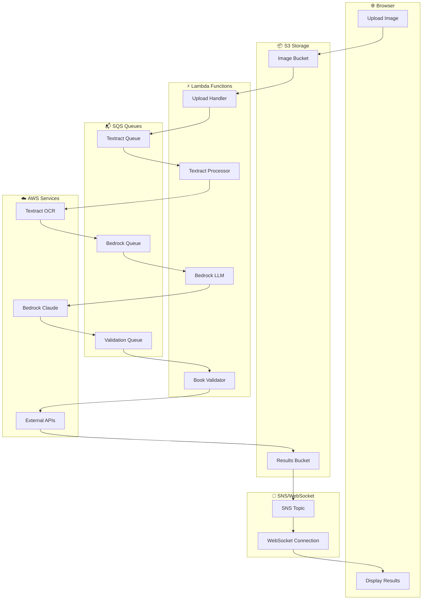

# BookImg - AI Book Recognition Pipeline

Extract book titles and authors from photos of bookshelves using AWS services and LLM agents.

## Overview

BookImg processes bookshelf photos through a multi-stage pipeline:

1. **Text Extraction**: AWS Textract extracts text from book spine images
2. **Candidate Generation**: AWS Bedrock (Claude 3 Haiku) parses fragmented text into title/author pairs
3. **Validation**: Multiple providers (Google Books, Open Library) validate and enrich book metadata
4. **Results**: Clean title/author pairs with ISBN, publisher, publication year, and purchase links

## Quick Start

### Installation
```bash
# Install dependencies
npm install

# Configure AWS credentials (see DEPLOYMENT.md for setup)
aws configure --profile bookimg-app
```

### Usage
```bash
# Basic extraction (AWS Textract + Bedrock only)
node index.ts extract bookshelf.jpg

# Extract with validation (requires API key in .env file)
node --env-file=.env index.ts extract bookshelf.jpg --validate googlebooks

# Test validation providers
node index.ts validate --provider openlibrary
```

### Environment Setup
Create a `.env` file for Google Books validation:
```bash
GOOGLE_BOOKS_API_KEY=your_api_key_here
```

## Architecture

### High-Level Data Flow
```
Bookshelf Photo
    ↓ (Upload)
AWS Textract (OCR)
    ↓ (Fragmented Text)
AWS Bedrock Claude (LLM Processing)
    ↓ (Structured Candidates)
Google Books / Open Library APIs (Validation)
    ↓ (Enriched Metadata)
Final Results (Title, Author, ISBN, Links)
```

### Example Data Transformation

**Input**: Bookshelf photo

**Textract Output** (Fragmented):
```
DANIEL C. DENNETT FROM BACTERIA TO BACH AND BACK
HARDEN
THE GENETIC
WHY DNA MATTERS
LOTTERY
FOR SOCIAL EQUALITY
```

**Bedrock Output** (Structured):
```json
{
  "candidates": [
    {
      "title": "From Bacteria to Bach and Back",
      "author": "Daniel C. Dennett",
      "confidence": 0.95
    },
    {
      "title": "The Genetic Lottery: Why DNA Matters for Social Equality",
      "author": "Kathryn Paige Harden", 
      "confidence": 0.88
    }
  ]
}
```

**Final Output** (Validated):
```json
{
  "books": [
    {
      "title": "From Bacteria to Bach and Back: The Evolution of Minds",
      "author": "Daniel C. Dennett",
      "isbn": "9780393242072",
      "publisher": "W. W. Norton & Company",
      "publishedDate": "2017-02-07",
      "confidence": 0.95,
      "validated": true,
      "purchaseLinks": {
        "googleBooks": "https://books.google.com/books?id=..."
      }
    }
  ]
}
```

### Production Infrastructure

The system runs entirely on AWS serverless infrastructure:



**Key Components:**
- **Web Interface**: API Gateway + Lambda serving htmx-based upload form
- **Processing Pipeline**: 4 Lambda functions connected via SQS queues
- **Real-time Notifications**: WebSocket API + DynamoDB for connection tracking
- **Storage**: S3 buckets for images and results
- **Security**: IAM roles with least-privilege access

## Status

### ✅ Fully Functional End-to-End System
- Web interface: https://1fd9v08g3m.execute-api.ap-southeast-2.amazonaws.com/UAT
- WebSocket API: `wss://v4sgq1aoqj.execute-api.ap-southeast-2.amazonaws.com/UAT`
- Real-time notifications with book validation results

### 📋 Next: Granular Processing Updates
Add intermediate status messages: Textract → Bedrock → Validation → Complete

## Features

### ✅ Complete AWS Infrastructure
- Two-stage Terraform deployment (bootstrap → main infrastructure)
- Proper security architecture: Root → Deployer User → Application User
- Environment-based resource naming (`bookimg-{env}`)
- Complete deployment automation

### ✅ Working CLI Application
- Fast AWS Textract integration (1-2 second extraction)
- S3 bucket management with session-based organization
- Comprehensive testing framework for accuracy measurement
- Support for multiple validation providers

### ✅ LLM Processing Pipeline
- AWS Bedrock integration with Claude 3 Haiku
- Structured candidate extraction from OCR output
- JSON output with confidence scoring
- Results saved to S3 as both raw text and parsed JSON

### ✅ Multiple Book Validation Providers
- Google Books API (excellent coverage, requires API key)
- Open Library API (free, good for academic books)
- Smart matching algorithms with similarity scoring
- Rich metadata: ISBNs, publishers, publication years, cover images

### ✅ Production Lambda Infrastructure
- Complete serverless pipeline with 4 Lambda functions
- API Gateway HTTP API with web interface
- SQS queues with dead letter queues for error handling
- Async processing with SNS notifications

### ✅ Real-Time Web Interface
- Live web interface at deployed API Gateway endpoint
- Drag-and-drop image uploads with pre-signed S3 URLs
- htmx-based frontend (no JavaScript framework needed)
- Processing pipeline automatically triggered on upload

### ✅ WebSocket Notification System
- WebSocket API Gateway for real-time connections
- DynamoDB table for connection tracking (jobId → connectionId)
- SNS integration for completion notifications
- Complete async flow with real-time updates


### 🎯 Nice to Have

**Enhanced Web Frontend**
- Mobile-responsive design optimized for smartphone cameras
- Interactive results display with book covers and metadata
- Batch processing for multiple images
- User accounts and processing history

## Validation Providers

### Open Library
- ✅ **Free**: No API key required
- ✅ **Good coverage**: Strong for academic and older books  
- ✅ **Rich metadata**: ISBNs, publishers, publication years
- ⚠️ **Rate limited**: 1 request per second

### Google Books
- ✅ **Excellent coverage**: Often finds books Open Library misses
- ✅ **Rich metadata**: Complete bibliographic information
- ✅ **Fast responses**: Higher rate limits
- ⚠️ **Requires setup**: API key and Books API enablement
- 💰 **Usage limits**: Free tier has daily quotas

**Recommendation**: Use Google Books for best results, Open Library as free alternative.

## Commands

### `extract <image-path>`
Extract book information from a bookshelf image.

```bash
# Basic extraction
node index.ts extract bookshelf.jpg

# With validation
node index.ts extract bookshelf.jpg --validate openlibrary
node --env-file=.env index.ts extract bookshelf.jpg --validate googlebooks
```

### `validate`
Test book validation in isolation with sample data.

```bash
# Test default provider (Open Library)
node index.ts validate

# Test specific provider
node --env-file=.env index.ts validate --provider googlebooks
```

### `test <image-path>`
Run comprehensive Textract API tests for accuracy comparison.

```bash
node index.ts test bookshelf.jpg --ground-truth '[{"title":"Book Title","authors":["Author"]}]'
```

## Configuration

- **AWS Region**: `ap-southeast-2`
- **S3 Buckets**: `bookimg-uat` (uploads), `bookimg-uat-results` (processing)
- **Bedrock Model**: `anthropic.claude-3-haiku-20240307-v1:0`
- **Web Interface**: Deployed at API Gateway endpoint (see deployment outputs)

## Documentation

### Deployment & Setup
- **[DEPLOYMENT.md](./DEPLOYMENT.md)** - Complete infrastructure deployment guide
- **[TERRAFORM.md](./TERRAFORM.md)** - Terraform-specific deployment steps

### Architecture Details  
- **[ASYNC_NOTIFICATION.md](./ASYNC_NOTIFICATION.md)** - Real-time WebSocket notification system

### Getting Started
For first-time setup, follow the deployment guide to:
1. Bootstrap AWS infrastructure with Terraform
2. Deploy main infrastructure and Lambda functions
3. Configure AWS profiles for application access
4. Test the CLI and web interface

The system is designed for production use with proper security, monitoring, and error handling throughout the pipeline.