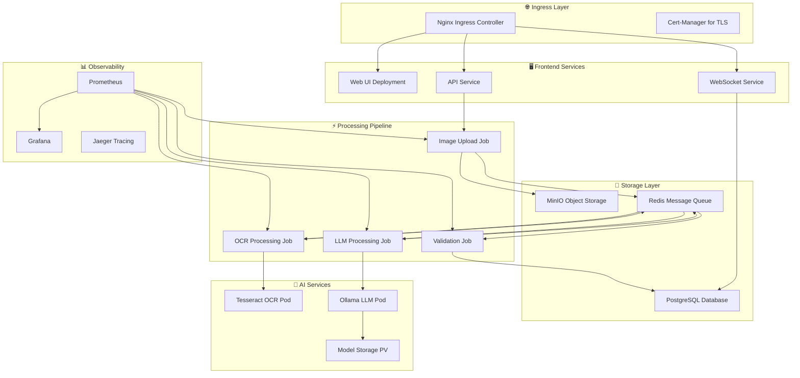

# BookImg: AWS to Kubernetes Migration Guide

## Executive Summary

This document outlines migrating BookImg from AWS-specific services to a cloud-agnostic Kubernetes architecture. The current system relies heavily on AWS Lambda, S3, SQS, SNS, and Bedrock services. The proposed Kubernetes solution provides vendor independence while maintaining scalability and reliability.

## Current AWS Architecture vs Kubernetes Equivalent

### Service Mapping

| AWS Service | Current Role | Kubernetes Equivalent | Notes |
|-------------|---------------|----------------------|--------|
| Lambda Functions | Serverless compute | Kubernetes Jobs/Deployments | Event-driven processing |
| S3 | Object storage | MinIO or Cloud Storage | Persistent volumes with object storage |
| SQS | Message queues | Redis/RabbitMQ | Message broker for async processing |
| SNS | Notifications | Kafka/NATS | Pub/sub messaging |
| API Gateway | HTTP API | Ingress Controller | Traffic routing and load balancing |
| WebSocket API | Real-time comms | WebSocket service | Custom WebSocket deployment |
| DynamoDB | NoSQL database | MongoDB/PostgreSQL | Connection tracking database |
| Textract | OCR service | Tesseract/PaddleOCR | Self-hosted OCR engine |
| Bedrock | LLM service | Ollama/vLLM | Self-hosted LLM inference |
| CloudWatch | Logging/Monitoring | Prometheus/Grafana | Observability stack |

## Kubernetes Core Concepts (Simplified)

### Key Components

**Pod**: The smallest deployable unit - a group of containers that share storage and network
```yaml
apiVersion: v1
kind: Pod
metadata:
  name: bookimg-processor
spec:
  containers:
  - name: app
    image: bookimg-processor:latest
```

**Deployment**: Manages multiple pods, handles rolling updates and scaling
```yaml
apiVersion: apps/v1
kind: Deployment
metadata:
  name: bookimg-api
spec:
  replicas: 3
  selector:
    matchLabels:
      app: bookimg-api
  template:
    spec:
      containers:
      - name: api
        image: bookimg-api:latest
```

**Service**: Exposes pods to network traffic (like an internal load balancer)
```yaml
apiVersion: v1
kind: Service
metadata:
  name: bookimg-api-service
spec:
  selector:
    app: bookimg-api
  ports:
  - port: 80
    targetPort: 3000
```

**Job**: Runs pods to completion (perfect for our processing pipeline)
```yaml
apiVersion: batch/v1
kind: Job
metadata:
  name: textract-processor
spec:
  template:
    spec:
      containers:
      - name: processor
        image: textract-processor:latest
      restartPolicy: Never
```

**ConfigMap/Secret**: Configuration and sensitive data management
```yaml
apiVersion: v1
kind: ConfigMap
metadata:
  name: bookimg-config
data:
  REDIS_URL: "redis://redis-service:6379"
  
---
apiVersion: v1
kind: Secret
metadata:
  name: bookimg-secrets
type: Opaque
data:
  GOOGLE_BOOKS_API_KEY: <base64-encoded-key>
```

## Proposed Kubernetes Architecture

### Core Infrastructure Stack



### Migration Architecture Components

#### 1. Web Interface
- **Current**: API Gateway + Lambda
- **New**: Nginx Ingress + Node.js Deployment
- **Benefits**: More control over routing, WebSocket support

#### 2. Processing Pipeline
- **Current**: 4 Lambda functions triggered by SQS
- **New**: 4 Kubernetes Jobs triggered by Redis queues
- **Benefits**: Better resource control, easier debugging

#### 3. Storage
- **Current**: S3 buckets
- **New**: MinIO (S3-compatible) + Persistent Volumes
- **Benefits**: True multi-cloud portability

#### 4. Messaging
- **Current**: SQS + SNS
- **New**: Redis + Kafka/NATS
- **Benefits**: More flexible messaging patterns

#### 5. AI Services
- **Current**: AWS Textract + Bedrock
- **New**: Self-hosted Tesseract + Ollama
- **Benefits**: No vendor lock-in, cost control

## Detailed Migration Plan

### Phase 1: Infrastructure Foundation (2-3 weeks)

1. **Kubernetes Cluster Setup**
   - Set up managed Kubernetes (EKS, GKE, or AKS for transition)
   - Install core components: Ingress, Cert-Manager, Prometheus
   - Configure storage classes and persistent volumes

2. **Storage Migration**
   - Deploy MinIO for object storage
   - Deploy PostgreSQL for structured data
   - Deploy Redis for message queuing
   - Migrate S3 data to MinIO buckets

### Phase 2: Core Services (3-4 weeks)

3. **Web Interface Containerization**
   - Containerize existing Node.js application
   - Create Kubernetes deployments and services
   - Implement health checks and readiness probes
   - Configure ingress for external access

4. **Database Migration**
   - Export DynamoDB data
   - Design PostgreSQL schema for connection tracking
   - Implement data migration scripts
   - Test data consistency

### Phase 3: Processing Pipeline (4-5 weeks)

5. **OCR Service Setup**
   - Evaluate OCR engines (Tesseract, PaddleOCR, EasyOCR)
   - Create containerized OCR service
   - Performance test against AWS Textract
   - Implement accuracy benchmarking

6. **LLM Service Migration**
   - Set up Ollama with Claude-equivalent models
   - Test model performance (Llama 3.1, Qwen, etc.)
   - Implement model switching capability
   - Performance and accuracy validation

7. **Message Queue System**
   - Replace SQS with Redis-based queues
   - Implement dead letter queue patterns
   - Add retry logic and error handling
   - Test end-to-end processing flow

### Phase 4: Advanced Features (2-3 weeks)

8. **Monitoring and Observability**
   - Deploy Prometheus + Grafana
   - Create dashboards for system metrics
   - Implement distributed tracing with Jaeger
   - Set up alerting rules

9. **Security and Compliance**
   - Implement RBAC (Role-Based Access Control)
   - Set up network policies
   - Configure secrets management
   - Security scanning and compliance checks

### Phase 5: Production Cutover (1-2 weeks)

10. **Testing and Validation**
    - End-to-end system testing
    - Performance benchmarking
    - Disaster recovery testing
    - User acceptance testing

11. **Go-Live**
    - Blue-green deployment strategy
    - DNS cutover
    - Monitoring during transition
    - Rollback procedures ready

## Pros and Cons Analysis

### ✅ Pros of Kubernetes Migration

**Vendor Independence**
- No lock-in to AWS-specific services
- Can run on any cloud provider or on-premises
- Easier to negotiate with cloud providers

**Cost Control**
- Predictable compute costs vs. Lambda pricing
- Can use spot instances for batch processing
- Better resource utilization

**Developer Experience**
- Easier local development with Docker Compose
- Better debugging capabilities
- More control over deployment process
- Standard container ecosystem

**Operational Benefits**
- Consistent deployment across environments
- Better resource monitoring and management
- Industry-standard observability tools
- Easier disaster recovery

**Technical Flexibility**
- Can choose best-of-breed tools for each component
- Easy to swap components (databases, message queues)
- Better integration testing capabilities

### ❌ Cons of Kubernetes Migration

**Complexity**
- Steep learning curve for Kubernetes concepts
- More infrastructure components to manage
- Networking complexity (services, ingress, DNS)
- YAML configuration overhead

**Operational Overhead**
- Need Kubernetes expertise in team
- More components to monitor and maintain
- Security management becomes your responsibility
- Backup and disaster recovery complexity

**Initial Migration Effort**
- Significant development time (3-4 months estimated)
- Risk of introducing bugs during migration
- Need to rebuild AWS-specific integrations
- Testing and validation overhead

**AI Service Challenges**
- Self-hosted OCR may not match Textract accuracy
- LLM hosting requires GPU resources (expensive)
- Model management and updates become manual
- Potential latency increases

**Performance Concerns**
- Cold start advantages of Lambda are lost
- Need to manage scaling manually
- Persistent infrastructure vs. serverless efficiency
- Network latency between components

## Cost Comparison

### Current AWS Costs (Monthly Estimates)
- Lambda executions: $50-200
- S3 storage: $20-50
- Textract API: $100-500
- Bedrock API: $200-1000
- Other services: $100
- **Total: $470-1,850/month**

### Kubernetes Costs (Monthly Estimates)
- Managed Kubernetes: $150-300
- Compute nodes: $200-800
- Storage: $50-150
- Load balancers: $50
- GPU for LLM: $200-500
- **Total: $650-1,800/month**

**Cost Analysis**: Similar total costs, but Kubernetes provides more predictable pricing and eliminates API call charges.

## Risk Assessment

### High Risk
- **AI Service Performance**: Self-hosted OCR/LLM may not match AWS quality
- **Team Expertise**: Learning curve for Kubernetes operations
- **Migration Complexity**: Risk of extended downtime during cutover

### Medium Risk
- **Development Time**: Project may take longer than estimated
- **Component Integration**: Ensuring all services work together properly
- **Security**: Managing security across multiple components

### Low Risk
- **Cost Overruns**: Kubernetes costs are more predictable
- **Vendor Lock-in**: Migration path is well-established

## Recommendations

### Recommended Approach: Hybrid Migration

1. **Start with managed Kubernetes** (EKS/GKE/AKS) to reduce operational complexity
2. **Keep AWS Textract initially** - migrate OCR as final step
3. **Migrate in phases** - don't attempt big-bang migration
4. **Invest in team training** - Kubernetes certification for key team members
5. **Use Terraform** - Infrastructure as Code for both AWS and Kubernetes resources

### Alternative: Cloud-Agnostic Serverless

Consider **Knative** on Kubernetes for serverless capabilities without vendor lock-in:
- Keeps serverless development model
- Provides auto-scaling similar to Lambda
- Runs on any Kubernetes cluster
- Easier migration path from Lambda

### Success Metrics

- **Migration Timeline**: Complete in 4-5 months
- **System Uptime**: 99.9% availability during and after migration
- **Performance**: Match or exceed current system performance
- **Cost**: Stay within 20% of current AWS costs
- **Team Capability**: All team members comfortable with Kubernetes basics

## Next Steps

1. **Team Assessment**: Evaluate current Kubernetes knowledge
2. **Proof of Concept**: Build minimal viable pipeline in Kubernetes
3. **Training Plan**: Kubernetes certification for team members
4. **Detailed Planning**: Break down phases into 2-week sprints
5. **Risk Mitigation**: Identify rollback procedures for each phase

This migration will provide significant long-term benefits in terms of vendor independence, cost predictability, and operational flexibility, but requires substantial upfront investment in time and learning.